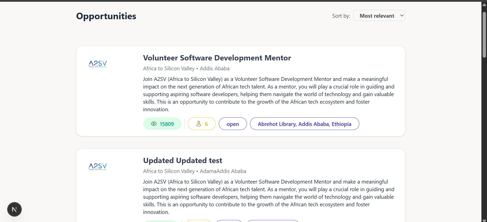
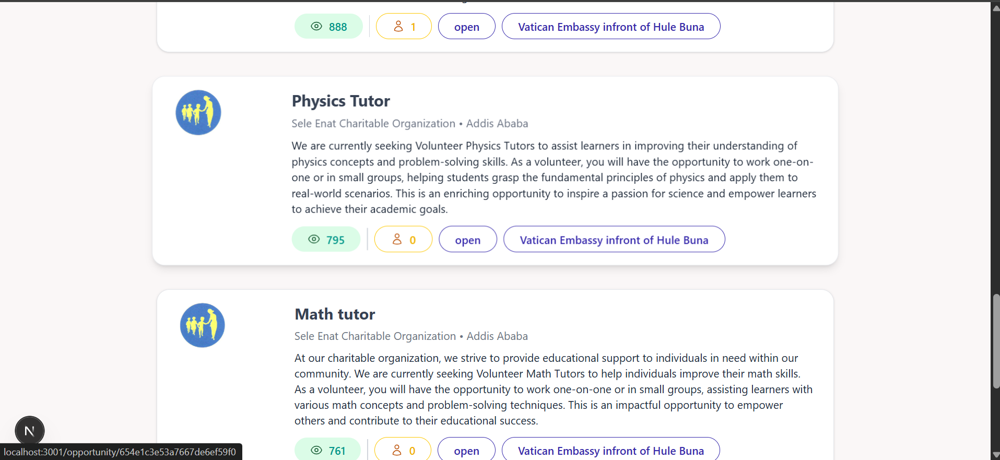

# Opportunity Listing Next.js App

This is a Next.js application that displays a list of job/volunteer opportunities. Users can browse opportunities on the main page and click on any opportunity card to view detailed information on a dedicated description page.

## Features

- Fetch and display a list of opportunities from an external API.
- Dynamic routing to display detailed information for each opportunity by its ID.
- Styled with Tailwind CSS for responsive and modern UI.
- Uses React components with TypeScript for type safety.
- Supports default images when an opportunity logo is missing.
- Clean separation of concerns: API calls, UI components, and pages.

## 📸 Screenshots

### 💼 Dashboard View
#### opportunites/search

### 📇 Job Card Example

---

## 🛠️ Tech Stack

- [Next.js](https://nextjs.org/) – React framework for SSR & routing
- [TypeScript](https://www.typescriptlang.org/) – Type safety
- [Tailwind CSS](https://tailwindcss.com/) – Utility-first styling
- [JSON](https://www.json.org/) – Used to mock job listings data

---

